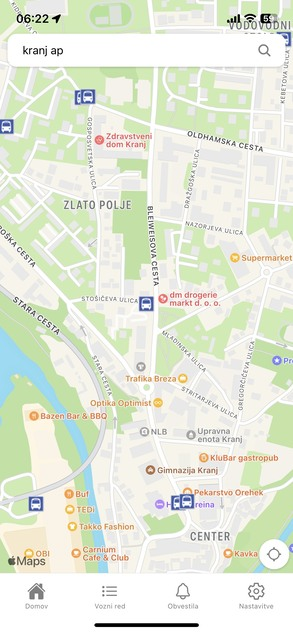

# Bus App mobile aplication

Bus App is a mobile application developed using React Native and Expo. It provides users with a convenient way to access information about bus routes, schedules, and real-time tracking. With Bus App, users can easily plan their journeys, find nearby bus stops, and stay updated on bus arrival times.

## Features

- **Route Information**: Browse through a list of available bus routes, including their start and end points, intermediate stops, and estimated travel time.

- **Nearby Stops**: Discover nearby bus stops based on the user's current location, making it convenient to find the closest stop for boarding or getting off.

- **Trip Planner**: Plan your journey by entering the starting point and destination, and let Bus App suggest the best bus routes and schedules for your trip.

## Screenshots




## Installation

To use the Bus App, follow these steps:

1. Make sure you have Node.js and npm (Node Package Manager) installed on your machine.

2. Install the Expo CLI globally by running the following command:

   ```bash
   npm install -g expo-cli
