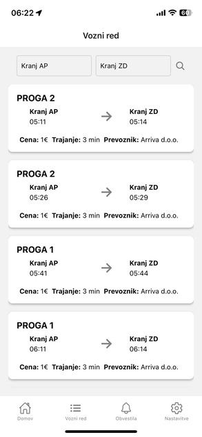
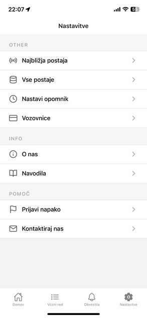

<h1 align="center"> BusApp -   bus transport  mobile app</h1>

BusApp is a mobile application intended for easy and faster search of information about bus services. Using the application, the user can easily find the appropriate station and the timetable for all routes of the selected station for every day of the year. The application offers different approaches to finding informations, such as interactive display of stations on the map, search with filtering and various functions that help in finding information.

The application was made for a final assignment. I made it for my hometown and surroundings, so the content is written in Slovenian.

## Screenshots

### Home page

### TimeTable page

### Notification page

### Settings page

## Libraries/tools

This project uses libraries and tools like:
- [React native](https://facebook.github.io/react-native) for the iOS & Android Apps
- [Expo](https://facebook.github.io/react-native) to simplify the development and deployment

### Data
The data for the mobile application is obtained from the API server that was created for this application. The api server is based on Node.js Express and SQLite3. You can find the data server at  [Arriva-KR-API-BusApp](https://github.com/Martinek16/Arriva-KR-API-BusApp)

### Examples/documentation
- Using the CLI in the [Getting Started](https://microsoft.github.io/react-native-windows/docs/getting-started) guide will set you up with a sample React Native for Windows app that you can begin editing right away.
- all the documentation for Expo can be found at  [Expo Documentation](https://docs.expo.dev/)

